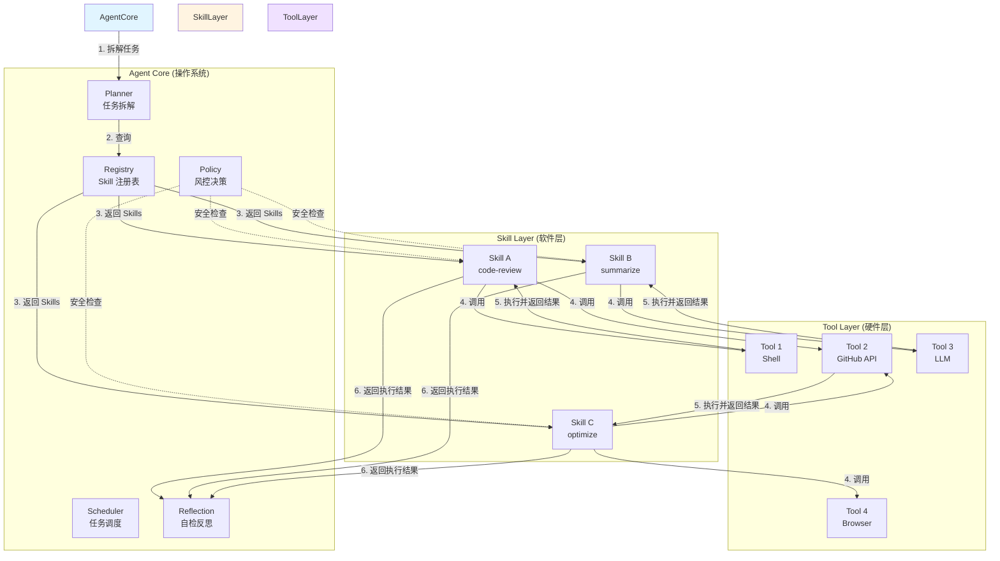

# Self-Evolution System v2 - 架构设计

> **版本**: v2.0
> **状态**: 设计阶段
> **作者**: Self-Evolution Team
> **更新时间**: 2025-02-04
> **语言**: 中文

---

## 📌 重要说明

**本项目使用中文作为主要交流语言。**

- GitHub Issues、PR、文档请使用中文
- 代码注释优先使用中文
- Commit Message 必须使用中文
- 变量名、函数名等代码标识符使用英文

详见：[贡献指南](../../CONTRIBUTING.md)

---

## 目录

1. [设计哲学](#设计哲学)
2. [核心概念](#核心概念)
3. [目标架构](#目标架构)
4. [Skill 生命周期](#skill-生命周期)
5. [目录结构](#目录结构)
6. [Agent 主循环](#agent-主循环)
7. [数据模型](#数据模型)
8. [安全与风控](#安全与风控)
9. [评估与演化](#评估与演化)
10. [从 v1 迁移](#从-v1-迁移)

---

## 设计哲学

### 核心原则

1. **Self-Evolution ≠ 模型变聪明**
   - 进化的不是 LLM 本身，而是 Skill 的创建、比较、晋升、淘汰的工程闭环
   - Agent 不需要"变聪明"也能持续优化

2. **明确的抽象边界**
   - Tool = 硬件（外部世界 I/O，权限边界）
   - Skill = 软件（Tool 的编排封装，可版本化）
   - Agent Core = 操作系统（决策、调度、风控、反思）

3. **数据驱动决策**
   - 所有关键决策基于历史数据和量化指标
   - Agent 永远不 hardcode skill 选择
   - 可审计、可回放、可回滚

4. **安全第一**
   - 沙箱执行，权限隔离
   - 所有高危操作需要人工确认
   - 完整的日志和追踪

---

## 核心概念

### 1. Tool（工具）

**定义**：外部世界 I/O 的抽象，代表权限边界。

**特征**：
- 昂贵且危险（可能造成实际影响）
- 权限边界清晰（文件、网络、命令等）
- 可独立测试和验证
- 通常由第三方提供（如 GitHub API、Shell）

**TypeScript 接口**：

```typescript
interface Tool {
  name: string;
  description: string;
  permissions: Permission[];

  execute(input: unknown): Promise<ToolResult>;
}

interface ToolResult {
  success: boolean;
  data?: unknown;
  error?: Error;
  cost?: number; // 执行成本（元）
}

interface Permission {
  type: 'file_system' | 'network' | 'command' | 'environment';
  rules: Record<string, unknown>;
}
```

**示例**：

```typescript
// Shell Tool
class ShellTool implements Tool {
  name = 'shell';
  description = 'Execute shell commands';
  permissions = [
    { type: 'command', rules: { allow: ['git', 'ls', 'cat'] } }
  ];

  async execute(input: { command: string }): Promise<ToolResult> {
    // 执行命令并返回结果
  }
}
```

---

### 2. Skill（技能）

**定义**：Tool 的编排封装，可版本化、可淘汰、可比较。

**特征**：
- 有明确的 intent（意图），不是万能工具
- 可组合多个 Tool 完成复杂任务
- 可版本化，支持 A/B 测试
- 有量化指标，支持自动晋升/淘汰

**TypeScript 接口**：

```typescript
interface Skill {
  // 元数据
  metadata: SkillMetadata;

  // 执行逻辑
  execute(context: SkillContext): Promise<SkillResult>;

  // 验证输入
  validate(input: unknown): boolean;
}

interface SkillMetadata {
  name: string;
  version: string;
  intent: string; // 核心意图，如 "code-review", "summarize-text"
  author: string;
  created_at: string;
  description?: string;
  tags?: string[];
  dependencies?: string[];
  cost_estimate?: number;
  success_threshold?: number;
}

interface SkillContext {
  input: unknown;
  tools: Map<string, Tool>;
  memory: Memory;
  config: Record<string, unknown>;
}

interface SkillResult {
  success: boolean;
  data?: unknown;
  error?: Error;
  metrics: {
    cost: number;
    latency: number;
    tokens_used?: number;
  };
}
```

**示例**：

```typescript
// Code Review Skill
class CodeReviewSkill implements Skill {
  metadata = {
    name: 'llm-code-reviewer',
    version: '1.0.0',
    intent: 'code-review',
    author: 'agent',
    created_at: '2025-02-04',
    description: '使用 LLM 进行代码审查',
    tags: ['llm', 'code', 'review'],
    cost_estimate: 0.5,
    success_threshold: 0.8
  };

  async execute(context: SkillContext): Promise<SkillResult> {
    const startTime = Date.now();

    // 1. 使用 GitHub Tool 获取 PR diff
    const githubTool = context.tools.get('github');
    const diff = await githubTool.execute({
      action: 'get-pr-diff',
      prNumber: context.input.prNumber
    });

    // 2. 使用 LLM Tool 分析代码
    const llmTool = context.tools.get('llm');
    const review = await llmTool.execute({
      prompt: `Review this code:\n${diff.data}`,
      model: 'claude-sonnet-4'
    });

    const cost = diff.metrics.cost + review.metrics.cost;
    const latency = Date.now() - startTime;

    return {
      success: true,
      data: review.data,
      metrics: { cost, latency }
    };
  }

  validate(input: unknown): boolean {
    return typeof input === 'object' && 'prNumber' in input;
  }
}
```

---

### 3. Agent Core（核心）

**定义**：决策、调度、风控、反思的操作系统。

**模块组成**：

```typescript
class AgentCore {
  planner: Planner;      // 任务拆解
  scheduler: Scheduler;  // 任务调度
  policy: Policy;        // 风控决策
  reflection: Reflection;// 自检反思
  registry: SkillRegistry; // Skill 注册表

  async run(goal: string): Promise<AgentResult>;
}
```

**职责**：
- **Planner**：将大目标拆解为小任务
- **Scheduler**：安排任务执行顺序和优先级
- **Policy**：判断是否允许执行（安全检查）
- **Reflection**：观察结果，分析问题，提出改进
- **Registry**：管理和查询所有 Skills

---

### 三者关系图



**关系说明**：

1. **Agent Core** 决定"做什么"（决策层）
2. **Skill** 决定"怎么做"（编排层）
3. **Tool** 负责"执行什么"（执行层）

**权限边界**：
- Agent Core → Skill：无权限限制
- Skill → Tool：受权限配置约束
- Tool → World：受系统级权限约束

---

### 实际使用场景

#### 场景 1：自动化代码审查流程

**目标**：当有新的 GitHub PR 时，自动进行代码审查。

**执行流程**：

```typescript
// 1. Agent Core 接收到目标
const goal = "Review PR #1234";

// 2. Planner 拆解任务
const plan = planner.decompose(goal);
// [
//   { id: 1, intent: "get-pr-diff", input: { prNumber: 1234 } },
//   { id: 2, intent: "code-review", input: { diff: "..." } },
//   { id: 3, intent: "post-comment", input: { review: "..." } }
// ]

// 3. 查询合适的 Skills
const reviewSkill = registry.getBest("code-review");

// 4. 执行 Skill（内部调用 Tools）
const result = await reviewSkill.execute({
  input: { prNumber: 1234 },
  tools: {
    github: githubTool,  // Tool: 获取 PR diff
    llm: llmTool        // Tool: 生成评论
  }
});

// Skill 内部流程：
// - Tool (GitHub API): 获取 PR #1234 的 diff
// - Tool (LLM): 分析代码，生成审查意见
// - Tool (GitHub API): 发布评论到 PR

// 5. Reflection 记录结果
await reflection.observe(reviewSkill, result);
```

**涉及组件**：
- **Agent Core**: Planner、Scheduler、Reflection
- **Skill**: code-review
- **Tools**: GitHub API、LLM

---

#### 场景 2：文档摘要生成

**目标**：自动生成技术文档的摘要。

**执行流程**：

```typescript
const goal = "Summarize the latest blog post";

// 1. Planner 拆解
const plan = [
  { intent: "fetch-url", input: { url: "https://blog.example.com/latest" } },
  { intent: "extract-text", input: { html: "..." } },
  { intent: "summarize", input: { text: "..." } }
];

// 2. 选择 Skill
const skill = registry.getBest("summarize");

// 3. 执行
const result = await skill.execute({
  input: { url: "https://blog.example.com/latest" },
  tools: {
    browser: browserTool,  // Tool: 获取网页
    llm: llmTool          // Tool: 生成摘要
  }
});

// Skill 内部：
// - Tool (Browser): 访问 URL，获取 HTML
// - Tool (Extractor): 提取正文文本
// - Tool (LLM): 生成摘要（300 字以内）
```

**涉及组件**：
- **Agent Core**: Planner、Scheduler
- **Skill**: summarize
- **Tools**: Browser、LLM

---

#### 场景 3：依赖项安全检查

**目标**：检查项目的依赖项是否存在安全漏洞。

**执行流程**：

```typescript
const goal = "Check for security vulnerabilities in dependencies";

// 1. Planner 拆解
const plan = [
  { intent: "read-package-json", input: { path: "./package.json" } },
  { intent: "check-vulnerabilities", input: { dependencies: [...] } },
  { intent: "generate-report", input: { findings: [...] } }
];

// 2. 选择 Skill
const skill = registry.getBest("security-check");

// 3. 执行（沙箱模式 - 只读）
const result = await sandbox.run(skill, task, {
  mode: "read-only"
});

// Skill 内部：
// - Tool (File System): 读取 package.json
// - Tool (NPM Audit API): 检查漏洞
// - Tool (LLM): 生成修复建议（不执行）
```

**涉及组件**：
- **Agent Core**: Planner、Policy（安全检查）、Sandbox（沙箱）
- **Skill**: security-check
- **Tools**: File System、NPM Audit API、LLM

**安全措施**：
- Policy 检查：只允许读操作
- Sandbox 模式：read-only
- 人工确认：执行修复前需要批准

---

## 目标架构

### 架构图

```
Goal / Trigger
      ↓
┌─────────────────────────────────────────────────────┐
│                   Agent Core (OS)                   │
│  ┌─────────┐ ┌──────────┐ ┌────────┐ ┌──────────┐ │
│  │ Planner │ │Scheduler │ │ Policy │ │Reflection│ │
│  └────┬────┘ └────┬─────┘ └───┬────┘ └────┬─────┘ │
│       │           │           │           │        │
│       └───────────┴───────────┴───────────┘        │
│                       ↓                             │
└───────────────────────┼─────────────────────────────┘
                        ↓
┌─────────────────────────────────────────────────────┐
│                   Skill Layer (Software)            │
│  ┌──────────────┐ ┌──────────────┐ ┌─────────────┐ │
│  │Experimental  │ │  Production  │ │   Retired   │ │
│  │   Skills     │ │   Skills     │ │   Skills    │ │
│  └──────────────┘ └──────────────┘ └─────────────┘ │
│                       ↓                             │
└───────────────────────┼─────────────────────────────┘
                        ↓
┌─────────────────────────────────────────────────────┐
│                    Tool Layer (Hardware)            │
│  ┌────────┐ ┌─────────┐ ┌───────┐ ┌──────────┐     │
│  │ Shell  │ │ Browser │ │GitHub │ │   LLM    │     │
│  └────────┘ └─────────┘ └───────┘ └──────────┘     │
└───────────────────────┼─────────────────────────────┘
                        ↓
                     World
```

---

## Skill 生命周期

### 流程图

```
Create → Register → Trial → Evaluate → Promote
  ↓          ↓         ↓         ↓          ↓
Intent    Metadata  Sandbox   Metrics   Production
          记录                  计算      使用
                              ↓
                         Monitor → Refactor / Replace / Retire
```

### 1. Create（创建）

**触发来源**：
- Reflection 分析发现能力缺口
- 人工手动创建
- 自动化测试失败

**强制要求**：
- 明确 intent，不允许万能 skill
- 提供 meta.json
- 通过 validator 检查

**示例 meta.json**：

```json
{
  "name": "llm-code-reviewer",
  "version": "1.0.0",
  "intent": "code-review",
  "author": "agent",
  "created_at": "2025-02-04T10:00:00Z",
  "description": "使用 Claude Sonnet 4 进行代码审查",
  "tags": ["llm", "code", "review", "quality"],
  "dependencies": ["github", "llm"],
  "cost_estimate": 0.5,
  "success_threshold": 0.8,
  "permissions": "code-review-permissions"
}
```

---

### 2. Register（注册）

**目标**：将 skill 注册到 registry，使其可被发现和使用。

**流程**：
1. 扫描 `experimental/` 目录
2. 验证 meta.json
3. 加载 skill 实现
4. 记录到 registry

**代码示例**：

```typescript
// 注册 skill
const skill = new LLMCodeReviewer();
await registry.register(skill, 'experimental');

// 查询 skill
const skills = await registry.list({ intent: 'code-review' });
// 返回: [
//   { name: 'llm-code-reviewer', status: 'experimental' },
//   { name: 'rule-based-reviewer', status: 'production' }
// ]
```

---

### 3. Trial（沙箱试运行）

**目标**：在安全环境中测试 skill，收集数据。

**沙箱模式**：
- **dry-run**: 只模拟，不执行任何操作
- **read-only**: 只读权限，可查看文件但不能修改
- **limited**: 限制资源（CPU、内存、时间）

**示例**：

```typescript
// 沙箱执行
const result = await sandbox.run(skill, task, {
  mode: 'dry-run',
  timeout: 5000,
  maxMemory: '512MB'
});

console.log(result);
// {
//   simulated: true,
//   actions: [
//     { type: 'github-api', action: 'get-pr-diff', safe: true },
//     { type: 'llm-call', action: 'generate-review', safe: true }
//   ],
//   estimatedCost: 0.5
// }
```

---

### 4. Evaluate（评估）

**核心指标**：

```typescript
interface SkillMetrics {
  success_rate: number;      // 成功率 (0-1)
  avg_cost: number;          // 平均成本（元）
  avg_latency: number;       // 平均延迟（ms）
  rollback_rate: number;     // 回滚率 (0-1)
  stability_score: number;   // 稳定性分数（方差倒数）
  execution_count: number;   // 执行次数
  last_execution_at: string; // 最后执行时间
}
```

**评分算法**：

```typescript
// 加权综合评分
function calculateScore(metrics: SkillMetrics, weights: ScoreWeights): number {
  return (
    metrics.success_rate * weights.success +
    (1 - metrics.avg_cost / MAX_COST) * weights.cost +
    (1 - metrics.avg_latency / MAX_LATENCY) * weights.latency +
    (1 - metrics.rollback_rate) * weights.rollback +
    metrics.stability_score * weights.stability
  );
}

// 示例权重
const balancedWeights = {
  success: 0.4,
  cost: 0.2,
  latency: 0.15,
  rollback: 0.15,
  stability: 0.1
};
```

**配置文件** (`agent/evaluation/metrics.yaml`):

```yaml
thresholds:
  promote:
    min_score: 0.8
    min_executions: 10
    min_success_rate: 0.85
  retire:
    max_score: 0.5
    max_executions: 20
    max_rollback_rate: 0.3

weights:
  balanced:
    success: 0.4
    cost: 0.2
    latency: 0.15
    rollback: 0.15
    stability: 0.1
  aggressive:
    success: 0.6
    cost: 0.1
    latency: 0.1
    rollback: 0.1
    stability: 0.1
```

---

### 5. Promote / Retire（晋升/淘汰）

**Promote 流程**：

```typescript
async function promote(skillName: string): Promise<void> {
  // 1. 获取评分
  const metrics = await memory.getStats(skillName);
  const score = scorer.calculateScore(metrics);

  // 2. 检查阈值
  const config = loadConfig('metrics.yaml');
  if (score < config.thresholds.promote.min_score) {
    throw new Error(`Score ${score} below threshold`);
  }

  // 3. 移动文件
  await mv(`skills/experimental/${skillName}`, `skills/production/${skillName}`);

  // 4. 更新 metadata
  skill.metadata.status = 'production';
  skill.metadata.promoted_at = new Date().toISOString();

  // 5. 记录日志
  await logger.info('Promoted', { skillName, score, metrics });
}
```

**Retire 流程**：

```typescript
async function retire(skillName: string): Promise<void> {
  // 1. 移动到 retired 目录
  await mv(`skills/production/${skillName}`, `skills/retired/${skillName}`);

  // 2. 标记为 deprecated
  skill.metadata.deprecated = true;
  skill.metadata.retired_at = new Date().toISOString();

  // 3. 保留历史数据
  await archive.backup(skillName);

  // 4. 记录日志
  await logger.warn('Retired', { skillName, reason: 'low_score' });
}
```

---

## 目录结构

```
self-evolution-system/
├── agent/                          # v2 架构核心目录
│   ├── core/                       # Agent Core 模块
│   │   ├── agent.ts                # 主 Agent 类
│   │   ├── planner.ts              # 任务拆解
│   │   ├── scheduler.ts            # 任务调度
│   │   ├── policy.ts               # 风控决策
│   │   ├── reflection.ts           # 自检反思
│   │   └── state.ts                # 状态管理
│   │
│   ├── skills/                     # Skill 层
│   │   ├── base.ts                 # Skill 基类接口
│   │   ├── registry.ts             # Skill 注册表
│   │   ├── scorer.ts               # Skill 评分器
│   │   ├── lifecycle.ts            # 生命周期管理
│   │   ├── validator.ts            # metadata 验证器
│   │   │
│   │   ├── experimental/           # 实验性 Skills
│   │   │   ├── llm-code-reviewer/
│   │   │   │   ├── index.ts
│   │   │   │   └── meta.json
│   │   │   └── rule-based-reviewer/
│   │   │       ├── index.ts
│   │   │       └── meta.json
│   │   │
│   │   ├── production/             # 生产环境 Skills
│   │   │   └── stable-reviewer/
│   │   │       ├── index.ts
│   │   │       └── meta.json
│   │   │
│   │   └── retired/                # 已淘汰的 Skills
│   │       └── old-reviewer/
│   │           ├── index.ts
│   │           └── meta.json
│   │
│   ├── tools/                      # Tool 层
│   │   ├── base.ts                 # Tool 基类接口
│   │   ├── shell.ts                # Shell Tool
│   │   ├── browser.ts              # Browser Tool
│   │   ├── github.ts               # GitHub API Tool
│   │   └── llm.ts                  # LLM Tool
│   │
│   ├── memory/                     # Memory 层
│   │   ├── short-term.ts           # 短期记忆（运行时）
│   │   ├── long-term.ts            # 长期记忆（向量数据库）
│   │   ├── episodic.ts             # 情景记忆（重要事件）
│   │   └── skill-stats.ts          # Skill 统计数据
│   │
│   ├── sandbox/                    # 沙箱执行环境
│   │   ├── executor.ts             # 执行器
│   │   ├── permissions.ts          # 权限检查器
│   │   ├── permissions.yaml        # 权限配置
│   │   └── isolation.ts            # 隔离机制
│   │
│   ├── evaluation/                 # 评估系统
│   │   ├── metrics.ts              # 指标定义
│   │   ├── scorer.ts               # 评分算法
│   │   ├── metrics.yaml            # 阈值配置
│   │   └── thresholds.yaml         # 晋升/淘汰阈值
│   │
│   ├── config/                     # 配置文件
│   │   ├── agent.yaml              # Agent 配置
│   │   ├── policy.yaml             # 安全策略
│   │   └── budgets.yaml            # 预算配置
│   │
│   └── run.ts                      # Agent 入口
│
├── skill/                          # v1 架构（保留）
│   └── ...
│
├── evolution-deployment/           # 部署脚本
│   └── ...
│
├── docs/                           # 文档
│   ├── v1/                         # v1 文档
│   │   └── README.md
│   ├── v2/                         # v2 文档
│   │   ├── architecture.md         # 本文档
│   │   ├── migration-guide.md      # 迁移指南
│   │   └── api-reference.md        # API 参考
│   └── github-issues-v2.md         # GitHub Issues 列表
│
├── README.md                       # 主 README（v1/v2 并存说明）
├── LICENSE
└── CONTRIBUTING.md
```

---

## Agent 主循环

### 核心算法

```typescript
async function mainLoop(agent: AgentCore): Promise<void> {
  while (agent.isRunning) {
    try {
      // 1. 获取目标
      const goal = await agent.getGoal();
      if (!goal) {
        await sleep(5000);
        continue;
      }

      // 2. 拆解任务
      const plan = await agent.planner.decompose(goal);
      logger.info('Plan created', { tasks: plan.length });

      // 3. 调度执行
      const scheduledTasks = agent.scheduler.schedule(plan);

      // 4. 执行每个任务
      for (const task of scheduledTasks) {
        // 查找合适的 skills
        const skills = await agent.registry.list({
          intent: task.intent
        });

        // 选择最佳 skill（基于历史数据）
        const bestSkill = selectBestSkill(skills, agent.memory);

        // 风控检查
        const allowed = await agent.policy.allow(bestSkill, task);
        if (!allowed) {
          logger.warn('Blocked by policy', { skill: bestSkill.name, task: task.id });
          continue;
        }

        // 沙箱执行
        const result = await agent.sandbox.run(bestSkill, task);

        // 反思观察
        await agent.reflection.observe(bestSkill, result, task);

        // 记录统计
        await agent.memory.record(bestSkill.name, result);
      }

      // 5. 生命周期检查
      await agent.lifecycle.tick();

    } catch (error) {
      logger.error('Loop error', { error });
      await sleep(10000);
    }
  }
}

// 选择最佳 skill
function selectBestSkill(
  skills: Skill[],
  memory: Memory
): Skill {
  // 只考虑 production skills
  const productionSkills = skills.filter(s => s.metadata.status === 'production');

  // 如果只有一个，直接返回
  if (productionSkills.length === 1) {
    return productionSkills[0];
  }

  // 多个：选择评分最高的
  return productionSkills.reduce((best, current) => {
    const bestScore = memory.getStats(best.name).score;
    const currentScore = memory.getStats(current.name).score;
    return currentScore > bestScore ? current : best;
  });
}
```

---

## 数据模型

### 1. Skill Stats（技能统计）

**表结构**：

```sql
CREATE TABLE skill_stats (
  id INTEGER PRIMARY KEY AUTOINCREMENT,
  skill_name TEXT NOT NULL,
  skill_version TEXT NOT NULL,
  intent TEXT NOT NULL,

  -- 执行统计
  execution_count INTEGER DEFAULT 0,
  success_count INTEGER DEFAULT 0,
  failure_count INTEGER DEFAULT 0,

  -- 性能指标
  total_cost REAL DEFAULT 0,
  avg_cost REAL DEFAULT 0,
  total_latency INTEGER DEFAULT 0,
  avg_latency INTEGER DEFAULT 0,

  -- 质量指标
  rollback_count INTEGER DEFAULT 0,
  rollback_rate REAL DEFAULT 0,
  stability_score REAL DEFAULT 0,

  -- 综合评分
  current_score REAL DEFAULT 0,

  -- 时间戳
  first_execution_at TIMESTAMP,
  last_execution_at TIMESTAMP,
  updated_at TIMESTAMP DEFAULT CURRENT_TIMESTAMP,

  UNIQUE(skill_name, skill_version)
);
```

**索引**：

```sql
CREATE INDEX idx_skill_stats_name ON skill_stats(skill_name);
CREATE INDEX idx_skill_stats_intent ON skill_stats(intent);
CREATE INDEX idx_skill_stats_score ON skill_stats(current_score DESC);
```

---

### 2. Execution Log（执行日志）

**表结构**：

```sql
CREATE TABLE execution_log (
  id INTEGER PRIMARY KEY AUTOINCREMENT,
  skill_name TEXT NOT NULL,
  task_id TEXT NOT NULL,
  intent TEXT NOT NULL,

  -- 执行结果
  success BOOLEAN NOT NULL,
  error_message TEXT,
  cost REAL,
  latency INTEGER,
  tokens_used INTEGER,

  -- 执行上下文
  input_json TEXT,
  output_json TEXT,
  metadata_json TEXT,

  -- 时间戳
  started_at TIMESTAMP,
  completed_at TIMESTAMP
);
```

---

### 3. Promotion History（晋升历史）

**表结构**：

```sql
CREATE TABLE promotion_history (
  id INTEGER PRIMARY KEY AUTOINCREMENT,
  skill_name TEXT NOT NULL,
  old_status TEXT NOT NULL,
  new_status TEXT NOT NULL,

  -- 决策依据
  score REAL NOT NULL,
  metrics_json TEXT NOT NULL,
  reason TEXT,

  -- 时间戳
  promoted_at TIMESTAMP DEFAULT CURRENT_TIMESTAMP
);
```

---

## 安全与风控

### 1. Policy（策略检查）

**配置文件** (`agent/config/policy.yaml`):

```yaml
# 危险命令黑名单
dangerous_commands:
  - pattern: "rm -rf"
    severity: "critical"
    action: "block"
  - pattern: "git push --force"
    severity: "high"
    action: "require_approval"
  - pattern: "chmod 777"
    severity: "high"
    action: "block"

# 权限模板
permissions:
  read_only:
    file_system:
      - "read:/**"
    network:
      - "GET:https://api.github.com/*"
    commands:
      - "git diff"
      - "git log"
      - "cat"
      - "ls"

  limited_write:
    file_system:
      - "read:/**"
      - "write:/tmp/*"
    network:
      - "*:https://api.github.com/*"
    commands:
      - "git commit"
      - "git push"

# 执行限制
limits:
  max_cost_per_day: 50        # 每日最大成本（元）
  max_executions_per_hour: 100 # 每小时最大执行次数
  max_latency_per_task: 30000  # 单个任务最大延迟（ms）
  timeout_default: 10000       # 默认超时（ms）
```

**实现代码**：

```typescript
class Policy {
  private config: PolicyConfig;

  constructor(configPath: string) {
    this.config = loadYaml(configPath);
  }

  async allow(skill: Skill, task: Task): Promise<boolean> {
    // 1. 检查危险命令
    if (this.containsDangerousCommands(task)) {
      return this.handleDangerousCommand(skill, task);
    }

    // 2. 检查权限
    const hasPermission = await this.checkPermission(skill, task);
    if (!hasPermission) {
      logger.warn('Permission denied', { skill: skill.name, task: task.id });
      return false;
    }

    // 3. 检查预算
    const withinBudget = await this.checkBudget();
    if (!withinBudget) {
      logger.warn('Budget exceeded', { dailyLimit: this.config.limits.max_cost_per_day });
      return false;
    }

    return true;
  }

  private containsDangerousCommands(task: Task): boolean {
    return this.config.dangerous_commands.some(dangerous =>
      task.input.includes(dangerous.pattern)
    );
  }

  private async handleDangerousCommand(skill: Skill, task: Task): Promise<boolean> {
    const dangerous = this.config.dangerous_commands.find(d =>
      task.input.includes(d.pattern)
    );

    if (dangerous.action === 'block') {
      logger.error('Blocked dangerous command', { pattern: dangerous.pattern });
      return false;
    }

    if (dangerous.action === 'require_approval') {
      // 发送通知请求人工确认
      await notifier.send('approval_required', {
        skill: skill.name,
        task: task.id,
        pattern: dangerous.pattern
      });

      // 等待确认（最多 5 分钟）
      return await this.waitForApproval(300000);
    }
  }
}
```

---

### 2. Sandbox（沙箱）

**执行模式**：

```typescript
enum SandboxMode {
  DryRun = 'dry-run',        // 只模拟
  ReadOnly = 'read-only',    // 只读
  Limited = 'limited',        // 限制资源
  Full = 'full'               // 完全权限
}

interface SandboxConfig {
  mode: SandboxMode;
  timeout?: number;
  maxMemory?: string;
  allowedPaths?: string[];
  networkAllowed?: boolean;
}
```

**实现代码**：

```typescript
class Sandbox {
  async run(
    skill: Skill,
    task: Task,
    config: SandboxConfig
  ): Promise<SkillResult> {
    // 1. 根据模式包装 skill
    const wrappedSkill = this.wrapSkill(skill, config);

    // 2. 设置超时
    const timeout = config.timeout || 10000;

    // 3. 执行
    return await this.withTimeout(timeout, async () => {
      return await wrappedSkill.execute({
        input: task.input,
        tools: this.getRestrictedTools(config),
        memory: this.getRestrictedMemory(),
        config: {}
      });
    });
  }

  private wrapSkill(skill: Skill, config: SandboxConfig): Skill {
    if (config.mode === SandboxMode.DryRun) {
      return new DryRunWrapper(skill);
    }
    if (config.mode === SandboxMode.ReadOnly) {
      return new ReadOnlyWrapper(skill);
    }
    return skill;
  }

  private async withTimeout<T>(
    timeout: number,
    fn: () => Promise<T>
  ): Promise<T> {
    return Promise.race([
      fn(),
      new Promise<never>((_, reject) =>
        setTimeout(() => reject(new Error('Timeout')), timeout)
      )
    ]);
  }
}
```

---

## 评估与演化

### 1. 自动评估流程

```typescript
class EvaluationSystem {
  async evaluateSkill(skillName: string): Promise<EvaluationReport> {
    // 1. 获取统计
    const stats = await this.memory.getStats(skillName);

    // 2. 计算评分
    const score = this.scorer.calculateScore(stats);

    // 3. 检查阈值
    const thresholds = this.config.getThresholds();
    const shouldPromote = score >= thresholds.promote.min_score;
    const shouldRetire = score <= thresholds.retire.max_score;

    // 4. 生成报告
    return {
      skillName,
      score,
      stats,
      shouldPromote,
      shouldRetire,
      recommendations: this.generateRecommendations(stats)
    };
  }

  private generateRecommendations(stats: SkillMetrics): string[] {
    const recommendations: string[] = [];

    if (stats.success_rate < 0.8) {
      recommendations.push('成功率偏低，建议检查错误日志');
    }

    if (stats.avg_cost > 1.0) {
      recommendations.push('成本偏高，建议优化 prompt 或切换模型');
    }

    if (stats.rollback_rate > 0.2) {
      recommendations.push('回滚率高，建议增加测试用例');
    }

    return recommendations;
  }
}
```

---

### 2. 演化闭环

```typescript
class EvolutionCycle {
  async tick(): Promise<void> {
    logger.info('Evolution cycle started');

    // 1. 评估所有 skills
    const skills = await this.registry.listAll();
    const reports = await Promise.all(
      skills.map(s => this.evaluation.evaluateSkill(s.name))
    );

    // 2. 自动晋升
    const toPromote = reports.filter(r => r.shouldPromote);
    for (const report of toPromote) {
      try {
        await this.lifecycle.promote(report.skillName);
        logger.info('Promoted', { skill: report.skillName, score: report.score });
      } catch (error) {
        logger.error('Promotion failed', { skill: report.skillName, error });
      }
    }

    // 3. 自动淘汰
    const toRetire = reports.filter(r => r.shouldRetire);
    for (const report of toRetire) {
      try {
        await this.lifecycle.retire(report.skillName);
        logger.warn('Retired', { skill: report.skillName, score: report.score });
      } catch (error) {
        logger.error('Retirement failed', { skill: report.skillName, error });
      }
    }

    // 4. 生成报告
    await this.generateEvolutionReport(reports);

    logger.info('Evolution cycle completed', {
      promoted: toPromote.length,
      retired: toRetire.length
    });
  }
}
```

---

## 从 v1 迁移

### 迁移策略

#### 阶段 1：共存（当前）

- v1 继续运行（`skill/` 目录）
- v2 新架构在 `agent/` 目录独立开发
- 两者通过数据库共享状态

#### 阶段 2：逐步迁移

1. **Tool 层**：将 v1 的 executor、compute 等模块封装为 v2 Tools
2. **Skill 层**：将 v1 的 analyzer、optimizer 等重构为 v2 Skills
3. **Agent Core**：实现新的主循环，与 v1 并行运行
4. **A/B 测试**：对比 v1 和 v2 的效果

#### 阶段 3：完全切换

- v2 证明稳定后，废弃 v1
- 保留 v1 代码作为参考（`skill-v1-legacy/`）

---

### 具体迁移步骤

**1. Tool 迁移映射**

| v1 模块 | v2 Tool | 状态 |
|---------|---------|------|
| `lib/executor/github-api.cjs` | `agent/tools/github.ts` | 待实现 |
| `lib/compute/local.cjs` | `agent/tools/shell.ts` | 待实现 |
| LLM 调用（分散在各处） | `agent/tools/llm.ts` | 待实现 |

**2. Skill 迁移映射**

| v1 模块 | v2 Skill | intent |
|---------|----------|--------|
| `lib/analyzer/classifier.cjs` | `classifier-skill` | `classify-content` |
| `lib/analyzer/risk-rater.cjs` | `risk-rater-skill` | `assess-risk` |
| `lib/deployment/optimizer.cjs` | `optimizer-skill` | `generate-optimization` |
| `lib/executor/auto-apply.cjs` | `auto-apply-skill` | `apply-change` |

**3. 数据库迁移**

```sql
-- v1 表结构保持不变
-- v2 新增表

-- 创建 v2 专用的表
CREATE TABLE skill_stats_v2 (...);
CREATE TABLE execution_log_v2 (...);

-- 迁移 v1 数据到 v2
INSERT INTO skill_stats_v2 (skill_name, execution_count, ...)
SELECT
  'v1-classifier',
  COUNT(*),
  ...
FROM v1_learning_log;
```

---

### 兼容性考虑

**向后兼容**：
- v2 能读取 v1 的数据库
- v2 能调用 v1 的模块（通过 adapter）
- v1 和 v2 可以同时运行（独立进程）

**配置兼容**：
```yaml
# agent/config/agent.yaml
v1:
  enabled: true
  path: ./skill

v2:
  enabled: true
  path: ./agent

migration:
  mode: "parallel"  # parallel | phased | full_switch
  data_sync: true
```

---

## 总结

v2 架构的核心改进：

1. **清晰的抽象边界**：Tool、Skill、Agent Core 职责明确
2. **完整的生命周期**：从创建到淘汰的闭环管理
3. **数据驱动决策**：基于量化指标的自动晋升/淘汰
4. **安全第一**：沙箱执行、权限控制、风控策略
5. **可演化**：Agent 不需要"变聪明"也能持续优化

**下一步**：
- 按照 [GitHub Issues 列表](../github-issues-v2.md) 逐步实现
- 每个 Issue 独立可执行，可验证
- 完成 Phase 0-1 后即可开始试用

---

**相关文档**：
- [GitHub Issues 列表](../github-issues-v2.md)
- [迁移指南](./migration-guide.md)（待创建）
- [API 参考](./api-reference.md)（待创建）
